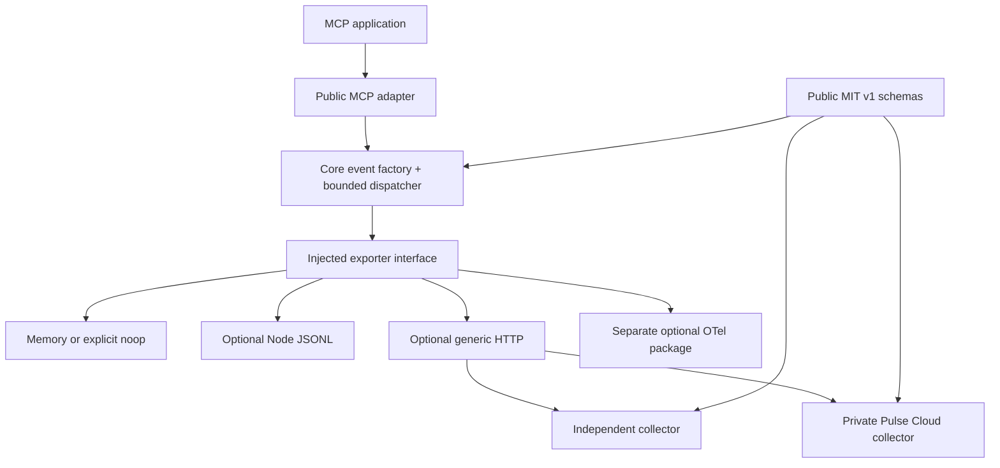

# Implementation status / Uygulama durumu

2026-09-11. SDK starting SHA `9f17526705be0ca4bbabe5a7b65e3de6f9c83dc3`; the worktree was initially clean. The owner authorized GitHub delivery and the separate Cloud rollout. **0.2.0 is a source release candidate, not an npm release.** No Cloud source was copied into the SDK. Current delivery receipts are recorded in [BUILD_STATUS.md](../BUILD_STATUS.md); the local implementation and test evidence below describes preparation before deployment.

## Phases / Fazlar

| Phase | Local result / Yerel sonuç | Files, symbols and evidence |
|---|---|---|
|0 baseline|Complete|`architecture/current-state.md`; SDK70/70 on24.11.1 with engine warning; Cloud257pass/10skip/1preexisting pinned-Node failure (actual22.22.0). Original logs retained, final checks separate.|
|1 independent core|Complete|`core/src/index.ts:createPulseCore`, injected `PulseExporter`; no default endpoint/key/Cloud import; explicit missing/noop/disabled diagnostics. Real packed/offline MCP fixture.|
|2 public contracts|Complete|canonical `contracts/{event,batch,ack}-v1.schema.json`; `generate-contracts.mjs`; generated types/versions; stable URNs; v1 handler meaning unchanged; optional adapter_version.|
|3 dispatcher/lifecycle|Complete|`core/src/exporter.ts:createDispatcher`, count/byte microtask trigger, one active attempt, bounded retry/partial/duplicate/drop, auth+stale-response recovery, pause/resume/reconfigure/concurrent flush/shutdown.75 focused core/dispatcher tests.|
|4 MCP compatibility|Complete for declared matrix|`mcp/src/index.ts:createPulse`; public structural hook, disabled identity, fail-open/strict, multi-copy marker, dynamic getter, this/return/error/cancel/update/subclass/thenable ordering tests; native/foreign Promise + ordinary thenable support.|
|5 privacy/conformance|Complete|schema-derived validation/snapshots, unknown-key rejection before getters, config/context snapshot, sentinels in HTTP/JSONL/diagnostics/CLI/OTel;12 Node/Python HMAC vectors; independent public-schema reference collector + external-exporter smoke.|
|6 local first value/CLI|Complete|`examples/local.ts` real official MCP InMemoryTransport→JSONL with network APIs forbidden; CLI init preview/idempotence/no overwrite, doctor static vs unknown runtime, bounded dev summary/dedup/nearest-rank percentiles/stderr EN/TR.|
|7 OTel/Python|Narrow OTel complete; Python intentionally gated|actual MCP→Pulse→OTel provider; INTERNAL handler span, unknown coverage, no inbound re-count/feedback; replay/conflict/sampling/privacy/epoch-time fixtures. `otel-mapping.md` dated official sources. Python crypto vector runner is not a Python SDK; bridge requires pilot demand+real fixture.|
|8 Cloud consumer|Complete locally|separate Cloud migration020/public contract provenance, side-by-side packed0.1/0.2, real durable PostgreSQL admission, partial/dedup/tenant/RLS negatives, same-instance key+quota-period recovery via local signed billing fixture. Existing UI/auth/billing behavior preserved; no production claim.|
|9 evidence/CI/benchmark|Complete locally; remote CI not run here|independent3tarball install, import-graph boundary, bundle+duplicate copies, offline+realHTTP, release dry-run; Node24.11.1/24.20.0.84 measured benchmark runs:24microcases×3 +4realMCPmodes×3; CPU/RSS/eventloop/quantiles/throughput/drop/config/module hashes. Ubuntu CI matrix configured, not claimed executed.|
|10 docs/first impression|Complete|Cloud-free README/package README, contracts/privacy/lifecycle/tooling/compatibility/OTel/benchmark/migration/agent setup guides; Cloud minimal EN/TR local vs managed routes; security publication state corrected without inventing a private contact.|
|11 release/migration|Local preparation complete|0.2.0 breaking construction API, same eventv1; core→adapter/optionalOTel publication order, additive Cloud-first compatibility window+rollback, pack audit/license/metadata/changelog. Actual publish/deploy need owner.|
|12 contribution/pilots|Technical preparation complete; human validation unperformed|ADR/RFC+contribution guide, external collector/exporter examples, five empty pilot slots/consent+feedback/checklist, separate activation/retention/blocker/contribution/Cloud conversion measures, unsent content/outreach drafts. No users or interview results invented.|

## Final verification / Son doğrulama

**Final source verified:** `pnpm check` **133/133 passed on Node24.11.1 and24.20.0**, including build, TypeScript, canonical drift check, actual core import graph, public conformance and12 Node/Python identity vectors. `pnpm verify:pack` **passed on both runtimes for all3tarballs**, including actual installed CLI executable, ESM bundle, duplicate real MCP/SDK copies, no-network real MCP and explicit HTTP fixtures. Last focused OTel/privacy review18/18 passed. Exact logs: `evidence/final-check-node24.11.1.txt`, `final-check-node24.20.0.txt`, `final-pack-node24.11.1.txt`, `final-pack-node24.20.0.txt`; archive/source hashes in `packed-consumer*.json`. Original final local archives: `artifacts/packed-stTvy9/`. Documentation refresh was separately packed and verified as `artifacts/packed-7dlTeT/`; the current `packed-consumer.json` contains its archive hashes. Benchmark module fingerprints were compared to final built modules and all match.

The complete reproducible commands are:

```sh
pnpm install --frozen-lockfile
pnpm check
pnpm verify:pack
pnpm example:local
node packages/mcp/dist/cli.js dev --file pulse-events.jsonl --locale tr
pnpm example:otel
pnpm benchmark
pnpm audit --prod
```

`pnpm check` checks committed generated files **before building**, builds3packages, audits the actual core import graph, typechecks code/examples/scripts, runs tests, public conformance and12 Python identity vectors. Initial dependency download and installed offline runtime are separate. Existing-cache `pnpm install --offline --frozen-lockfile` passed. `verify:pack` runs real package executables, not only source imports.

Local example: one real MCP call→one accepted JSONL event; Turkish CLI shows1observation with no invalid/duplicate records and stdout0bytes. OTel example: one real call→one span; stdout0bytes. `evidence/local-examples-20260911.json`. Runtime audit0known advisories (`evidence/runtime-audit-20260911.json`). Benchmark (`evidence/benchmark-20260911.json`):64event queue/2000calls→64accepted+1936overflow drops; stalled200event shutdown within recorded9.63ms for10ms budget. These are one-machine measurements, not universal timing or zero-loss guarantees.

Cloud final local check has265passed/10existing skipped. Skips are two opt-in browser suites (`security-browser`, `website-analytics-browser`) lacking explicitly configured targets, not DB/RLS tests. The changed EN/TR onboarding routes passed a separate2/2 real browser run on an isolated local dev server. Root/web TS and golden metric fixtures pass. Final Cloud vendor archives are byte-identical to the final SDK packed core/MCP archives; old0.1.0 dependency graphs remain installed. Final Cloud artifacts/checksum evidence is `docs/evidence/cloud-public-sdk-artifacts-20260911.json` in that separate repository.

## Runtime dependency graph / Çalışma zamanı bağımlılıkları



Core root uses native Node crypto/AsyncLocalStorage; third-party runtime dependencies0. It does not import/create I/O exporters. Only the explicitly chosen adapter/exporter adds its own dependencies. SDK never imports Cloud source; Cloud consumes the public packed artifacts.

## Working API / Çalışan API

These patterns are typechecked in `examples/quickstarts.ts` and executed through real local/HTTP integration tests:

```ts
import { createPulse } from '@reviseflow/pulse';
import { createJsonlExporter } from '@reviseflow/pulse-core/jsonl';
const local = createPulse({
  environment: 'development',
  exporter: createJsonlExporter({ path: './pulse-events.jsonl' }),
});
// const server = local.wrapServer(new McpServer(...)); before registration
```

```ts
import { createHttpExporter } from '@reviseflow/pulse-core/http';
const managed = createPulse({
  environment: 'production',
  exporter: createHttpExporter({
    endpoint: process.env.PULSE_COLLECTOR_URL!,
    authorization: `Bearer ${process.env.PULSE_WRITE_KEY!}`,
  }),
});
// Application validates environment variables; credentials stay server-only.
```

## Boundaries and next human steps / Sınırlar ve insan adımları

- No access blocker: both local repositories and isolated test DB were accessible. The website research tool could not open the public Cloud page; local source/browser tests supplied scoped evidence, not production proof.
- npm 0.2.0 publication, customer plan/key changes, paid operations, email and outreach are outside this GitHub/Cloud delivery. See [BUILD_STATUS.md](../BUILD_STATUS.md) for actual commit, CI and deployment status.
- Owner reviews/releases the additive Cloud collector support, then core0.2.0→MCP/optionalOTel packages; keep0.1 accepted until rollout/rollback is complete. Old history remainsv1. Rollback keeps additive collector support and restores pinned0.1 + old construction API. `migration-release.md` and Cloud `docs/cloud-integration-migration.md` give exact boundaries.
- GitHub private vulnerability reporting was enabled and verified through the repository API during delivery; see SECURITY.md. Published npm registry comparison is a post-publication gate and was deliberately not run for unavailable 0.2.0.
- Remote Ubuntu CI execution and broader runtimes/hosts remain unverified; declared local proof is macOSarm64 Node24.11.1/24.20.0 ESM/MCP2.0.0. Browser/Edge/CJS/Python/v1/full serverless-host integrations are not claimed. Malicious side-effectful then getters cannot be fully transparent; the documented supported promise surface is narrower.
- Five independent pilots, week2/4 retention, conversion, Python/v1 demand and any permanent free Cloud plan require people and real evidence. They remain unperformed; no phone-home was added.

TR: Teknik uygulama tamamlandı; sahip GitHub aktarımını ve ayrı Cloud dağıtımını yetkilendirdi. Güncel teslim kanıtları BUILD_STATUS.md içindedir. npm 0.2.0 yayını ve gerçek kullanıcı pilotları henüz yapılmadı. Başlangıç hatası yanlış Node seçimiydi. Kayıtlar gözlenen handler çağrılarına aittir; kişi sayısı, örnekleme kapsamı veya kayıpsızlık iddiası yoktur.
