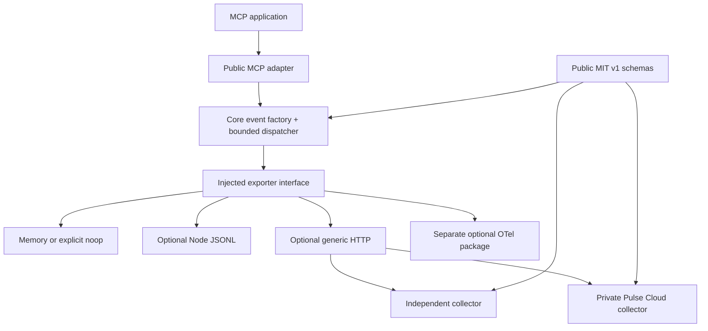

# Implementation status / Uygulama durumu

## Owner-authorized 0.2.1 release / Sahip yetkili yayın — 2026-09-12

The follow-up request authorizes Git delivery, npm updates, SDK README refresh and production deployment. The synchronized patch is **0.2.1** (verified unused before preparation). Exact-version `pnpm check` passed205 tests on each declared Node runtime; frozen offline installation passed with no lockfile dependency change. README, changelog and release instructions now target0.2.1. Current execution and final external evidence are tracked in [BUILD_STATUS.md](../BUILD_STATUS.md); the local-only0.2.0-labelled checkpoint below remains historical evidence, not the final release candidate. Independent human pilots remain unperformed.

TR: Yeni talep Git/npm/README/deploy işlemlerini yetkilendirdi. Sürüm0.2.1 olarak hizalandı ve iki runtime'da205 test geçti. Son dış işlem kanıtları BUILD_STATUS.md içinde tutulur; aşağıdaki yayımlanmamış0.2.0 etiketli kayıt önceki kontrol noktasıdır.

## Correctness task — 2026-09-12

**Complete locally, unreleased.** Work started on clean `e304c641f0e09b91b401366e247f73f22550ccfa`; the review SHA was not used as HEAD or a reset target. SDK MIT LICENSE and AGENTS.md read; Cloud remained untouched. No review-probe archive was found in the workspace/attachments searched; all permanent regressions call the actual implementation. Installed dependency/lock/runtime/registry baseline: [correctness-baseline-20260912.json](evidence/correctness-baseline-20260912.json). The declared Node 24.11.1/24.20.0 and MCP 2.0.0 pins are unchanged.

Applied plan: capture existing gates and red regressions; share a safe internal result snapshot; correct target-project dependency resolution; preserve HTTP minimums with bounded dispatcher policy; run both runtime gates and independent packed consumers; update existing contract/release/pilot documents. No public/cloud architecture redesign or runtime dependency was needed.

| Finding | Initial real behavior / regression | Minimal change and final evidence | Blocker |
|---|---|---|---|
| Exporter result divergence | `tests/export-result.test.ts`: `rejects negative retry minimum consistently`, `rejects NaN retry minimum consistently`, `rejects unknown result field consistently` all failed before source changes: runtime dropped, smoke returned passed/2. | `core/src/export-result.ts:snapshotExportResult` owns one allowlist/validation/snapshot boundary; `exporter.ts:request`, `conformance.ts:runExporterConformance`, `http.ts:acknowledgement` consume it. 31 new tests; focused conformance/dispatcher/privacy 66 passed. Mutable arrays, changing/throwing getters, malformed categories/controls, valid partial results and original MCP handler behavior covered. | None locally. |
| Hoisted CLI dependency | `tests/cli-resolution.test.ts`: `accepts the hoisted package that Node ESM resolves from each workspace application` failed before the fix: ESM resolved, CLI null/false. | `mcp/src/cli.ts:installedMcp/projectInfo` uses built-in metadata lookup and bounded fixed default-ESM resolver from application cwd. Added safe resolution status; no project code/install/network. CLI 24 passed on each runtime, including 19 new cases. Real installed MCP 2.0.0 tarball CLI passed normal/hoisted/nested layouts. | Custom loaders/bundlers and actual pnpm e2e not claimed. |
| Retry-After truncation | `tests/http-retry.test.ts`: 120s/date/huge minimum results were clamped; real dispatcher made second attempt at 60000ms. Initial 19 tests had 9 failures including a 40.5ms minimum retried at 40ms. | `http.ts:retryAfter` preserves delay; dispatcher retains existing per-delay drop policy and rounds timers up. 22 new fake-clock real exporter/dispatcher cases; core/dispatcher/retry 97 passed, retry22 passed on second runtime. Real loopback tarball consumer verifies minimums and remainder-only resend. | None locally. |

Related defects exposed by acceptance checks were also reproduced and fixed: a malformed 202 acknowledgement discarded valid `Retry-After:120` and retried at 5ms (`preserves a valid Retry-After minimum while rejecting a malformed 202 acknowledgement`); npm's actual `.bin/pulse` symlink silently did nothing (`runs its command when Node enters through an npm-style executable symlink`). HTTP now merges the header even for an invalid body; `import.meta.main` fixes the executable with no import side effect. These are narrow corrections on the requested delivery paths.

### Verification ledger / Doğrulama kaydı

| Command / scope | Runtime | Actual result |
|---|---|---|
| Baseline `pnpm check` / existing build, typecheck, contracts, tests, conformance, identities, boundaries | 24.11.1 | 133/133; no pre-existing failure. Baseline `pnpm verify:pack` also passed, but its CLI help check previously asserted only empty stdout and did not prove command execution. |
| Final `pnpm check` | 24.11.1 and 24.20.0 | 205/205 on each, 13 test files, all composed gates passed. `correctness-check-node*.txt`. No separate lint command exists. |
| `pnpm verify:pack --evidence docs/evidence/correctness-packed-node24.11.1.json` and equivalent second-runtime filename | 24.11.1 and 24.20.0 | Passed; three actual tarballs with identical hashes across runtimes, file counts core45/MCP12/OTel6. `.d.ts`, all public entry points, npm bin, MIT license, README and metadata; exact dependency alignment; private-source/secret allowlist scan; pack/publish dry-run member parity. |
| Clean unrelated npm consumers | Both declared runtimes | Real installed MCP2.0.0, no repository symlinks or private package; types, ESM bundle, duplicate copies; network blocked after install for real MCP memory and JSONL, plus packed conformance. Real bin init/doctor normal/hoisted/nested targets; stdout empty, real stderr response required. Synthetic unit symlinks are separate from this npm evidence. |
| Explicit loopback collector through packed HTTP exporter | Both declared runtimes | 5 real HTTP requests, maximum concurrency1; 120000ms/60000ms produces1request/0retry/1drop; 200ms and250ms minimums honored. Partial result accepted2/duplicate1/permanent rejected1, only omitted ID resent. Exact measured timings in packed evidence; no Cloud proof. |
| `pnpm benchmark docs/evidence/correctness-benchmark-node24.11.1.json` | 24.11.1 | Existing84 measurements completed (24 microcases×3 +4 real MCP modes×3); scoped machine evidence, not a guarantee. |
| `pnpm audit --prod` | 24.11.1 | No known vulnerabilities returned. |
| Registry metadata read | Local network request, 2026-09-12 | All three `latest` tags remain0.2.0; baseline local archives match their exact registry SHA-512 integrity. No corrected release exists. This is metadata/integrity inspection, not a registry candidate installation. |
| Corrected-release registry smoke, fresh GitHub CI, independent developer/workspace user acceptance | Not run | Pending publication/external environment/people. Historical receipts below do not validate these changes. |

During integration, the strict core import graph gate correctly rejected the newly extracted internal module; only `export-result.js` was added to its exact internal allowlist, with external/I/O/dependency prohibitions retained. The first Node24.20 packed run exposed npm11.19's keyed dry-run JSON output (npm11.6 returns the package directly); the verifier now accepts both envelopes and still compares exact package/version/file lists. Both reruns passed. These fixed validation-integration issues are not baseline failures or open blockers. Red source evidence and baseline summary are in `evidence/correctness-regressions-before.txt`.

Public exporter/event/HTTP wire types, dependency manifests, lockfile and runtime support are unchanged. No new runtime result restriction: smoke now applies the existing runtime contract. `retryMaxMs` stays a per-delay limit/backoff ceiling, not an elapsed budget; only unconfirmed IDs above its limit drop under `droppedRetries`. CLI adds `mcpStatus`/localized explanation without replacing existing fields. Patch-level release is appropriate; no version was invented or published. The current0.2.0-labelled local archives must not be confused with the already-published0.2.0. Owner must choose an unused exact patch, align generated/lock/package versions and rerun gates; see `migration-release.md`. Current source is uncommitted/unpushed. Temporary consumers/sockets/timers were cleaned; intentional release tarballs remain under ignored `artifacts/`.

TR: Başlangıç temiz HEAD ve133 testle kaydedildi; üç hata gerçek uygulamada önce başarısız testlerle gösterildi. Ortak sonuç snapshot'ı, hedef proje ESM çözümlemesi ve server minimumunu koruyan retry düzeltildi; npm bin ve bozuk202 header kaybı da kabul testlerinde yakalanıp kapatıldı. İki Node sürümünde205 test ve üç gerçek tarball tüketicisi geçti. Yeni bağımlılık, wire/API migration veya destek genişlemesi yok. Publish/deploy/PR/issue/Cloud çağrısı yapılmadı. Exact patch/CI/yayın sonrası registry ve insan kabulü bekliyor; geçmiş teslim kayıtları bu yerel değişikliğin kanıtı değildir.

## Historical independent-SDK implementation / Önceki bağımsız SDK uygulaması

2026-09-11. SDK starting SHA `9f17526705be0ca4bbabe5a7b65e3de6f9c83dc3`; the worktree was initially clean. The owner authorized GitHub delivery and the separate Cloud rollout. **0.2.0 is now published on npm with owner authorization.** No Cloud source was copied into the SDK. Current delivery receipts are recorded in [BUILD_STATUS.md](../BUILD_STATUS.md); the local implementation and test evidence below describes preparation before deployment.

## Phases / Fazlar

| Phase | Local result / Yerel sonuç | Files, symbols and evidence |
|---|---|---|
|0 baseline|Complete|`architecture/current-state.md`; SDK70/70 on24.11.1 with engine warning; Cloud257pass/10skip/1preexisting pinned-Node failure (actual22.22.0). Original logs retained, final checks separate.|
|1 independent core|Complete|`core/src/index.ts:createPulseCore`, injected `PulseExporter`; no default endpoint/key/Cloud import; explicit missing/noop/disabled diagnostics. Real packed/offline MCP fixture.|
|2 public contracts|Complete|canonical `contracts/{event,batch,ack}-v1.schema.json`; `generate-contracts.mjs`; generated types/versions; stable URNs; v1 handler meaning unchanged; optional adapter_version.|
|3 dispatcher/lifecycle|Complete|`core/src/exporter.ts:createDispatcher`, count/byte microtask trigger, one active attempt, bounded retry/partial/duplicate/drop, auth+stale-response recovery, pause/resume/reconfigure/concurrent flush/shutdown.75 focused core/dispatcher tests.|
|4 MCP compatibility|Complete for declared matrix|`mcp/src/index.ts:createPulse`; public structural hook, disabled identity, fail-open/strict, multi-copy marker, dynamic getter, this/return/error/cancel/update/subclass/thenable ordering tests; native/foreign Promise + ordinary thenable support.|
|5 privacy/conformance|Complete|schema-derived validation/snapshots, unknown-key rejection before getters, config/context snapshot, sentinels in HTTP/JSONL/diagnostics/CLI/OTel;12 Node/Python HMAC vectors; independent public-schema reference collector + external-exporter smoke.|
|6 local first value/CLI|Complete|`examples/local.ts` real official MCP InMemoryTransport→JSONL with network APIs forbidden; CLI init preview/idempotence/no overwrite, doctor static vs unknown runtime, bounded dev summary/dedup/nearest-rank percentiles/stderr EN/TR.|
|7 OTel/Python|Narrow OTel complete; Python intentionally gated|actual MCP→Pulse→OTel provider; INTERNAL handler span, unknown coverage, no inbound re-count/feedback; replay/conflict/sampling/privacy/epoch-time fixtures. `otel-mapping.md` dated official sources. Python crypto vector runner is not a Python SDK; bridge requires pilot demand+real fixture.|
|8 Cloud consumer|Complete locally|separate Cloud migration020/public contract provenance, side-by-side packed0.1/0.2, real durable PostgreSQL admission, partial/dedup/tenant/RLS negatives, same-instance key+quota-period recovery via local signed billing fixture. Existing UI/auth/billing behavior preserved; no production claim.|
|9 evidence/CI/benchmark|Complete locally and on the declared Ubuntu CI matrix|independent3tarball install, import-graph boundary, bundle+duplicate copies, offline+realHTTP, release dry-run; Node24.11.1/24.20.0.84 measured benchmark runs:24microcases×3 +4realMCPmodes×3; CPU/RSS/eventloop/quantiles/throughput/drop/config/module hashes. Ubuntu CI run34625143572 passed both Node versions.|
|10 docs/first impression|Complete|Cloud-free README/package README, contracts/privacy/lifecycle/tooling/compatibility/OTel/benchmark/migration/agent setup guides; Cloud minimal EN/TR local vs managed routes; security publication state corrected without inventing a private contact.|
|11 release/migration|Local preparation complete|0.2.0 breaking construction API, same eventv1; core→adapter/optionalOTel publication order, additive Cloud-first compatibility window+rollback, pack audit/license/metadata/changelog. GitHub delivery and separate Cloud deployment were authorized and completed; all three npm packages are now published.|
|12 contribution/pilots|Technical preparation complete; human validation unperformed|ADR/RFC+contribution guide, external collector/exporter examples, five empty pilot slots/consent+feedback/checklist, separate activation/retention/blocker/contribution/Cloud conversion measures, unsent content/outreach drafts. No users or interview results invented.|

## Final verification / Son doğrulama

**Final source verified:** `pnpm check` **133/133 passed on Node24.11.1 and24.20.0**, including build, TypeScript, canonical drift check, actual core import graph, public conformance and12 Node/Python identity vectors. `pnpm verify:pack` **passed on both runtimes for all3tarballs**, including actual installed CLI executable, ESM bundle, duplicate real MCP/SDK copies, no-network real MCP and explicit HTTP fixtures. Last focused OTel/privacy review18/18 passed. Exact logs: `evidence/final-check-node24.11.1.txt`, `final-check-node24.20.0.txt`, `final-pack-node24.11.1.txt`, `final-pack-node24.20.0.txt`; archive/source hashes in `packed-consumer*.json`. Original final local archives: `artifacts/packed-stTvy9/`. Documentation refresh was separately packed and verified as `artifacts/packed-7dlTeT/`; its historical archive hashes preceded the npm README refresh; current release archive hashes are in `registry-consumer.json`. Benchmark module fingerprints were compared to final built modules and all match.

The complete reproducible commands are:

```sh
pnpm install --frozen-lockfile
pnpm check
pnpm verify:pack
pnpm example:local
node packages/mcp/dist/cli.js dev --file pulse-events.jsonl --locale tr
pnpm example:otel
pnpm benchmark
pnpm audit --prod
```

`pnpm check` checks committed generated files **before building**, builds3packages, audits the actual core import graph, typechecks code/examples/scripts, runs tests, public conformance and12 Python identity vectors. Initial dependency download and installed offline runtime are separate. Existing-cache `pnpm install --offline --frozen-lockfile` passed. `verify:pack` runs real package executables, not only source imports.

Local example: one real MCP call→one accepted JSONL event; Turkish CLI shows1observation with no invalid/duplicate records and stdout0bytes. OTel example: one real call→one span; stdout0bytes. `evidence/local-examples-20260911.json`. Runtime audit0known advisories (`evidence/runtime-audit-20260911.json`). Benchmark (`evidence/benchmark-20260911.json`):64event queue/2000calls→64accepted+1936overflow drops; stalled200event shutdown within recorded9.63ms for10ms budget. These are one-machine measurements, not universal timing or zero-loss guarantees.

Cloud final local check has265passed/10existing skipped. Skips are two opt-in browser suites (`security-browser`, `website-analytics-browser`) lacking explicitly configured targets, not DB/RLS tests. The changed EN/TR onboarding routes passed a separate2/2 real browser run on an isolated local dev server. Root/web TS and golden metric fixtures pass. Final Cloud vendor archives are byte-identical to the final SDK packed core/MCP archives; old0.1.0 dependency graphs remain installed. Final Cloud artifacts/checksum evidence is `docs/evidence/cloud-public-sdk-artifacts-20260911.json` in that separate repository.

## Runtime dependency graph / Çalışma zamanı bağımlılıkları



Core root uses native Node crypto/AsyncLocalStorage; third-party runtime dependencies0. It does not import/create I/O exporters. Only the explicitly chosen adapter/exporter adds its own dependencies. SDK never imports Cloud source; Cloud consumes the public packed artifacts.

## Working API / Çalışan API

These patterns are typechecked in `examples/quickstarts.ts` and executed through real local/HTTP integration tests:

```ts
import { createPulse } from '@reviseflow/pulse';
import { createJsonlExporter } from '@reviseflow/pulse-core/jsonl';
const local = createPulse({
  environment: 'development',
  exporter: createJsonlExporter({ path: './pulse-events.jsonl' }),
});
// const server = local.wrapServer(new McpServer(...)); before registration
```

```ts
import { createHttpExporter } from '@reviseflow/pulse-core/http';
const managed = createPulse({
  environment: 'production',
  exporter: createHttpExporter({
    endpoint: process.env.PULSE_COLLECTOR_URL!,
    authorization: `Bearer ${process.env.PULSE_WRITE_KEY!}`,
  }),
});
// Application validates environment variables; credentials stay server-only.
```

## Boundaries and next human steps / Sınırlar ve insan adımları

- No access blocker: both local repositories and isolated test DB were accessible. The website research tool could not open the public Cloud page; local source/browser tests supplied scoped evidence, not production proof.
- npm 0.2.0 publication was separately authorized and completed. Customer plan/key changes, paid operations, email and outreach remain outside this delivery. See [BUILD_STATUS.md](../BUILD_STATUS.md) for actual commit, CI and deployment status.
- Owner reviews/releases the additive Cloud collector support, then core0.2.0→MCP/optionalOTel packages; keep0.1 accepted until rollout/rollback is complete. Old history remainsv1. Rollback keeps additive collector support and restores pinned0.1 + old construction API. `migration-release.md` and Cloud `docs/cloud-integration-migration.md` give exact boundaries.
- GitHub private vulnerability reporting was enabled and verified through the repository API during delivery; see SECURITY.md. The post-publication registry consumer gate is recorded separately in `evidence/registry-consumer.json`.
- Ubuntu 24.04 CI passed Node 24.11.1/24.20.0; local proof also covers macOS arm64. ESM/MCP 2.0.0 remain the declared boundary; broader runtimes/hosts remain unverified. Browser/Edge/CJS/Python/v1/full serverless-host integrations are not claimed. Malicious side-effectful then getters cannot be fully transparent; the documented supported promise surface is narrower.
- Five independent pilots, week2/4 retention, conversion, Python/v1 demand and any permanent free Cloud plan require people and real evidence. They remain unperformed; no phone-home was added.

TR: Teknik uygulama tamamlandı; sahip GitHub aktarımını ve ayrı Cloud dağıtımını yetkilendirdi. Güncel teslim kanıtları BUILD_STATUS.md içindedir. npm 0.2.0 yayını tamamlandı; gerçek kullanıcı pilotları henüz yapılmadı. Başlangıç hatası yanlış Node seçimiydi. Kayıtlar gözlenen handler çağrılarına aittir; kişi sayısı, örnekleme kapsamı veya kayıpsızlık iddiası yoktur.
